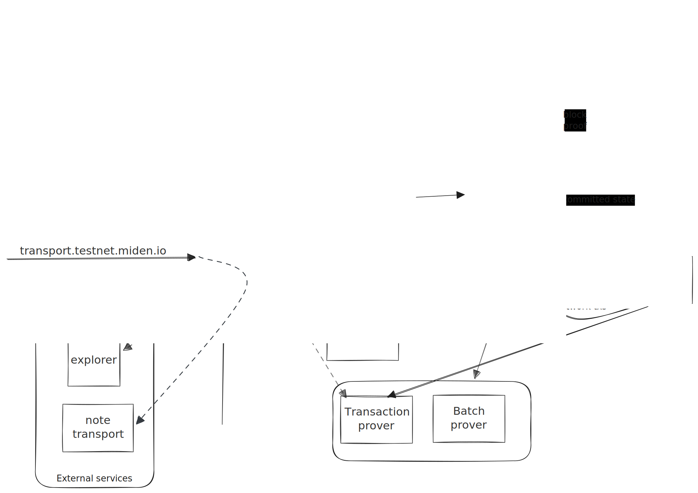

# Network architecture

The network itself consists of five distributed components: store, block-producer, network transaction builder, validator, and RPC.

The components can be run on separate instances when optimised for performance, but can also be run as a single process
for convenience. At the moment both of Miden's public networks (testnet and devnet) are operating in single process
mode.

Inter-component communication is done using a gRPC API which is assumed trusted. In other words this _must not_ be
public. External communication is handled by the RPC component with a separate external-only gRPC API.

The image below shows a rough example of what a network architecture may look like. Only the more important data
flows are pictured to improve clarity.

## RPC

The RPC component provides a public gRPC API with which users can submit transactions and query chain state. Queries are
validated and then proxied to the store. Similarly, transaction proofs are verified before submitting them to the
block-producer. This takes a non-trivial amount of load off the block-producer.

This is the _only_ external facing component and it essentially acts as a shielding proxy that prevents bad requests
from impacting block production.

It can be trivially scaled horizontally e.g. with a load-balancer in front as shown above.

## Store

The store is responsible for persisting the chain state. It is effectively a database which holds the current state of
the chain, wrapped in a gRPC interface which allows querying this state and submitting new blocks.

It receives new blocks from the block-producer, which it then submits to the validator for signing before it is committed
on chain. It then submits the block to the prover whereafter the block is marked as proven. Blocks therefore undergo
two levels of finalization, `committed` and then `proven`.

It expects that this gRPC interface is _only_ accessible internally i.e. there is an implicit assumption of trust.

## Block-producer

The block-producer is responsible for aggregating received transactions into blocks and submitting them to the store.

Transactions are placed in a mempool and are periodically sampled to form batches of transactions. These batches are
proved, and then periodically aggregated into a block. This constructed block is sent to the validator, which verifies the
contents of the block before signing the block's commitment and returning the signature to the block-producer. This signed 
block is then submitted to the store where it is proven and committed.

Proof generation in production is typically outsourced to a remote machine with appropriate resources. For convenience,
it is also possible to perform proving in-process. This is useful when running a local node for test purposes.

## Network transaction builder

The network transaction builder monitors the mempool for network notes, and creates transactions consuming these.
We call these network transactions and at present this is the only entity that is allowed to create such transactions.
This restriction will be lifted in the future, but for now this component _must_ be enabled to have support for
network transactions.

The mempool is monitored via a gRPC event stream served by the block-producer.

Internally, the builder spawns a dedicated actor for each network account that has pending notes. Actors that remain
idle (no notes to consume) for a configurable duration are automatically deactivated to conserve resources, and are
re-activated when new notes arrive. The idle timeout can be tuned with the `--ntx-builder.idle-timeout` CLI
argument (default: 5 minutes).

Accounts whose actors crash repeatedly (due to database errors) are automatically deactivated after a configurable
number of failures, preventing resource exhaustion. The threshold can be set with
`--ntx-builder.max-account-crashes` (default: 10).

The builder also exposes an internal gRPC server that the RPC component uses to proxy debugging endpoints such as
`GetNetworkNoteStatus`. In bundled mode this is wired automatically; in distributed mode operators must set
`--ntx-builder.url` (or `MIDEN_NODE_NTX_BUILDER_URL`) on the RPC component.

## Validator

The validator is responsible for verifying the integrity of the blockchain by signing new blocks before they can be committed.

At the moment this is implemented by having all transactions sent here to be re-executed to double-check their integrity. This
also guards against bugs in the proving or execution systems, by backing up the transactions and their private inputs. This 
forms part of our training wheels while Miden is maturing.

The validator signs a new block if:

- all transactions were previously verified
- block proof is valid
- block delta matches the aggregated transaction deltas
- block header is valid and matches the data
- block builds on the current chain tip
